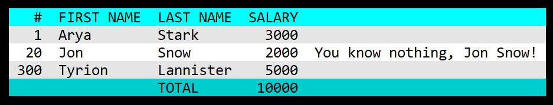

# go-pretty

[](https://travis-ci.com/jedib0t/go-pretty)
[](https://coveralls.io/github/jedib0t/go-pretty?branch=master)
[](https://goreportcard.com/report/github.com/jedib0t/go-pretty)
[](https://godoc.org/github.com/jedib0t/go-pretty)


Utilities to prettify console output of tables, lists, text, etc.

## Table

Pretty-print tables into ASCII/Unicode strings.

```
+-----+------------+-----------+--------+-----------------------------+
|   # | FIRST NAME | LAST NAME | SALARY |                             |
+-----+------------+-----------+--------+-----------------------------+
|   1 | Arya       | Stark     |   3000 |                             |
|  20 | Jon        | Snow      |   2000 | You know nothing, Jon Snow! |
| 300 | Tyrion     | Lannister |   5000 |                             |
+-----+------------+-----------+--------+-----------------------------+
|     |            | TOTAL     |  10000 |                             |
+-----+------------+-----------+--------+-----------------------------+
```



Detailed documentation can be found here: [table/](table)

## List

Pretty-print lists with multiple levels/indents into ASCII/Unicode strings.

```
 ■ Game Of Thrones
   ■ Winter
   ■ Is
   ■ Coming
     ■ This
     ■ Is
     ■ Known
 ■ The Dark Tower
   ■ The Gunslinger
```

Detailed documentation can be found here: [list/](list)

# Progress

Track the Progress of one or more Tasks (like downloading multiple files in
parallel).

Sample Progress Tracking:
```
Calculating Total   #  1 ... done! [3.25K in 100ms]
Calculating Total   #  2 ... done! [6.50K in 100ms]
Downloading File    #  3 ... done! [9.75KB in 100ms]
Transferring Amount #  4 ... done! [$26.00K in 200ms]
Transferring Amount #  5 ... done! [£32.50K in 201ms]
Downloading File    #  6 ... done! [58.50KB in 300ms]
Calculating Total   #  7 ... done! [91.00K in 400ms]
Transferring Amount #  8 ... 60.9% (●●●●●●●●●●●●●●◌◌◌◌◌◌◌◌◌) [$78.00K in 399.071ms]
Downloading File    #  9 ... 32.1% (●●●●●●●○◌◌◌◌◌◌◌◌◌◌◌◌◌◌◌) [58.50KB in 298.947ms]
Transferring Amount # 10 ... 13.0% (●●○◌◌◌◌◌◌◌◌◌◌◌◌◌◌◌◌◌◌◌◌) [£32.50K in 198.84ms]
```

Detailed documentation can be found here: [progress/](progress)

## Text

Utility functions to manipulate text with or without ANSI escape sequences. Most
of the functions available are used in one or more of the other packages here.

   - Align text horizontally or vertically
     - [text/align.go](text/align.go) and [text/valign.go](text/valign.go)
   - Colorize text
     - [text/color.go](text/color.go)
   - Cursor Movement
     - [text/cursor.go](text/cursor.go)
   - Format text (convert case)
     - [text/format.go](text/format.go)
   - String Manipulation (Pad, RepeatAndTrim, RuneCount, Trim, etc.)
     - [text/string.go](text/string.go)
   - Transform text (UnixTime to human-readable-time, pretty-JSON, etc.)
     - [text/transformer.go](text/transformer.go)
   - Wrap text
     - [text/wrap.go](text/wrap.go)

The unit-tests for each of the above show how these can be used. There GoDoc
should also have examples for all the available functions.

## Benchmarks

Partial output of `make bench`:
```
BenchmarkList_Render-8            	  200000	      5443 ns/op	     872 B/op	      47 allocs/op
BenchmarkProgress_Render-8        	       5	 300630230 ns/op	    4060 B/op	      90 allocs/op
BenchmarkTable_Render-8           	   20000	     73939 ns/op	    6067 B/op	     197 allocs/op
BenchmarkTable_RenderCSV-8        	  100000	     18680 ns/op	    2977 B/op	      54 allocs/op
BenchmarkTable_RenderHTML-8       	   50000	     27565 ns/op	    4450 B/op	      53 allocs/op
BenchmarkTable_RenderMarkdown-8   	  100000	     20612 ns/op	    2913 B/op	      52 allocs/op
```
