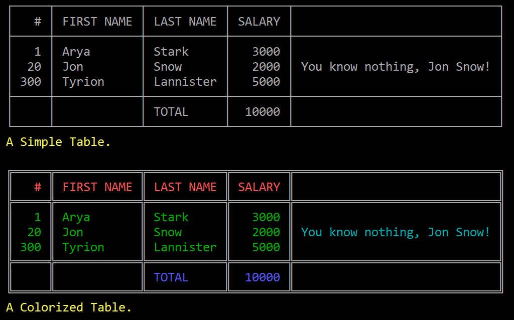
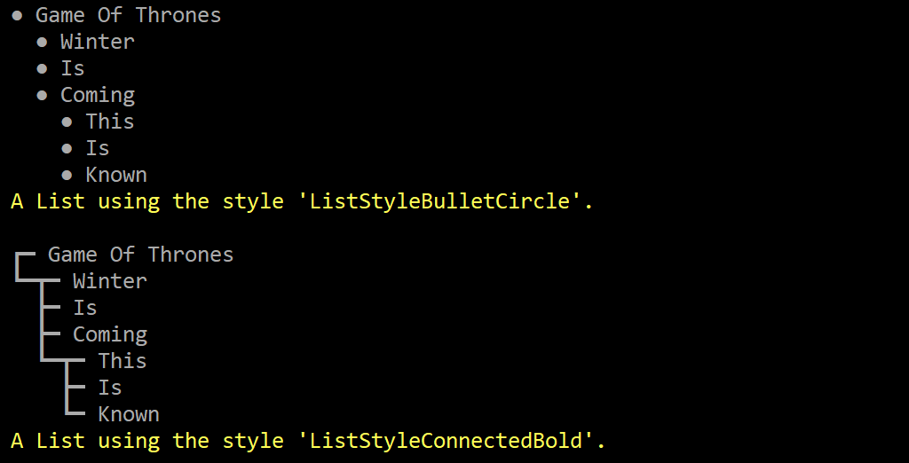

# go-pretty

[](https://travis-ci.org/jedib0t/go-pretty)
[](https://godoc.org/github.com/jedib0t/go-pretty)
[](https://goreportcard.com/report/github.com/jedib0t/go-pretty)

Utilities to prettify console output of tables, lists, etc.

## Table

Pretty-print tables into ASCII/Unicode strings.

  - Supports Header and Footer
  - Supports Adding Rows one-by-one or as a group
  - Auto (horizontal) Alignment (numeric columns are aligned Right)
  - Custom (horizontal) Alignment per column
  - Custom (vertical) VAlignment per column (and multi-line column support)
  - Completely customizable styles
    - Many ready-to-use styles: [table_style.go](table_style.go)
    - Colorize Headers/Body/Footers using [github.com/fatih/color][fatih.color]
    - Custom text-case for Headers/Body/Footers
    - Enable separators between each row
    - Render table without a Border
  - Render as:
    - (ASCII/Unicode) Table
    - CSV
    - HTML Table (with custom CSS Style)

### Example

Run the [sample code](demo/table/table.go) using `go run demo/table/table.go` to get:



## List

Pretty-print lists with multiple levels/indents into ASCII/Unicode strings.

  - Completely customizable styles
    - Many ready-to-use styles: [list_style.go](list_style.go)

### Example

Run the [sample code](demo/list/list.go) using `go run demo/list/list.go` to get:



## Benchmarks

```
$ go test -bench . -benchmem
goos: linux                                                                                                           
goarch: amd64                                                                                                         
pkg: github.com/jedib0t/go-pretty                                                                                     
BenchmarkList_Render-8           1000000              1659 ns/op             608 B/op         24 allocs/op            
BenchmarkTable_Render-8           100000             23502 ns/op            6434 B/op        384 allocs/op            
BenchmarkTable_RenderCSV-8        300000              5402 ns/op            2641 B/op         89 allocs/op            
BenchmarkTable_RenderHTML-8       200000              7027 ns/op            4113 B/op         88 allocs/op            
PASS                                                                                                                  
ok      github.com/jedib0t/go-pretty    7.458s                                                                        
```


[fatih.color]: https://github.com/fatih/color
