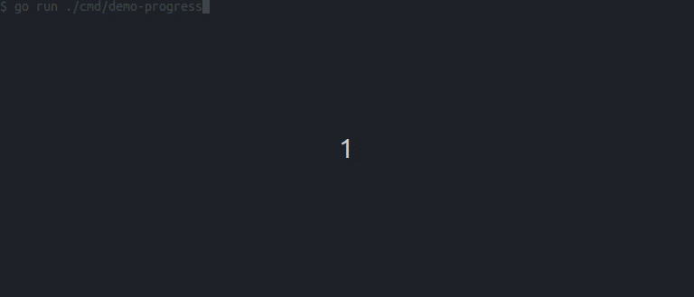

# go-pretty

[](https://pkg.go.dev/github.com/jedib0t/go-pretty/v6)
[](https://github.com/jedib0t/go-pretty/actions?query=workflow%3ACI+event%3Apush+branch%3Amain)
[](https://coveralls.io/github/jedib0t/go-pretty?branch=main)
[](https://goreportcard.com/report/github.com/jedib0t/go-pretty/v6)
[](https://sonarcloud.io/dashboard?id=jedib0t_go-pretty)

Utilities to prettify console output of tables, lists, progress-bars, text, etc.
with a heavy emphasis on customization.

## Usage

The current major version of this package is __v6__, and it follows the standard
outlined [here](https://go.dev/doc/modules/version-numbers#major-version).

Run `go get github.com/jedib0t/go-pretty/v6` to add this as a dependency to your
project, and import the packages in your code using one or more of these:
* `github.com/jedib0t/go-pretty/v6/list`
* `github.com/jedib0t/go-pretty/v6/progress`
* `github.com/jedib0t/go-pretty/v6/table`
* `github.com/jedib0t/go-pretty/v6/text`

## Table

Pretty-print tables in a terminal with colors, nested tables and more.

```
+-----+------------+-----------+--------+-----------------------------+
|   # | FIRST NAME | LAST NAME | SALARY |                             |
+-----+------------+-----------+--------+-----------------------------+
|   1 | Arya       | Stark     |   3000 |                             |
|  20 | Jon        | Snow      |   2000 | You know nothing, Jon Snow! |
| 300 | Tyrion     | Lannister |   5000 |                             |
+-----+------------+-----------+--------+-----------------------------+
|     |            | TOTAL     |  10000 |                             |
+-----+------------+-----------+--------+-----------------------------+
```

Execute `go run github.com/jedib0t/go-pretty/v6/cmd/demo-table@latest colors` to get:


More details can be found here: [table/](table)

## Progress

Track the Progress of one or more Tasks like downloading multiple files in
parallel.



More details can be found here: [progress/](progress)

## List

Pretty-print lists with multiple levels/indents into ASCII/Unicode strings.

```
╭─ Game Of Thrones
│  ├─ Winter
│  ├─ Is
│  ╰─ Coming
│     ├─ This
│     ├─ Is
│     ╰─ Known
╰─ The Dark Tower
   ╰─ The Gunslinger
```

More details can be found here: [list/](list)

## Text

Utility functions to manipulate text with or without ANSI escape sequences. Most
of the functions available are used in one or more of the other packages here.

   - Align text [Horizontally](text/align.go) or [Vertically](text/valign.go)
   - [Colorize](text/color.go) text
   - Move [cursor](text/cursor.go)
   - [Format](text/format.go) text (convert case)
   - Manipulate [strings](text/string.go) (Pad, RepeatAndTrim, RuneCount, etc.)
   - [Transform](text/transformer.go) text (UnixTime to human-readable-time, pretty-JSON, etc.)
   - [Wrap](text/wrap.go) text

GoDoc has examples for all the available functions.
