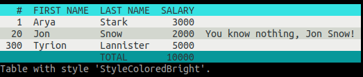

# go-pretty

[](https://pkg.go.dev/github.com/jedib0t/go-pretty/v6)
[](https://github.com/jedib0t/go-pretty/actions?query=workflow%3ACI+event%3Apush+branch%3Amain)
[](https://coveralls.io/github/jedib0t/go-pretty?branch=main)
[](https://goreportcard.com/report/github.com/jedib0t/go-pretty)
[](https://sonarcloud.io/dashboard?id=jedib0t_go-pretty)

Utilities to prettify console output of tables, lists, progress-bars, text, etc.

## Usage

The current major version of this package is __v6__, and it follows the standard
outlined [here](https://go.dev/doc/modules/version-numbers#major-version).

Run `go get github.com/jedib0t/go-pretty/v6` to add this as a dependency to your
project, and import the packages in your code using one or more of these:
* `github.com/jedib0t/go-pretty/v6/list`
* `github.com/jedib0t/go-pretty/v6/progress`
* `github.com/jedib0t/go-pretty/v6/table`
* `github.com/jedib0t/go-pretty/v6/text`

## Table

Pretty-print tables into ASCII/Unicode strings.

```
+-----+------------+-----------+--------+-----------------------------+
|   # | FIRST NAME | LAST NAME | SALARY |                             |
+-----+------------+-----------+--------+-----------------------------+
|   1 | Arya       | Stark     |   3000 |                             |
|  20 | Jon        | Snow      |   2000 | You know nothing, Jon Snow! |
| 300 | Tyrion     | Lannister |   5000 |                             |
+-----+------------+-----------+--------+-----------------------------+
|     |            | TOTAL     |  10000 |                             |
+-----+------------+-----------+--------+-----------------------------+
```



More details can be found here: [table/](table)

## List

Pretty-print lists with multiple levels/indents into ASCII/Unicode strings.

```
╭─ Game Of Thrones
│  ├─ Winter
│  ├─ Is
│  ╰─ Coming
│     ├─ This
│     ├─ Is
│     ╰─ Known
╰─ The Dark Tower
   ╰─ The Gunslinger
```

More details can be found here: [list/](list)

# Progress

Track the Progress of one or more Tasks (like downloading multiple files in
parallel).

Sample Progress Tracking:
```
Calculating Total   #  1 ... done! [3.25K in 501ms]
Calculating Total   #  2 ... done! [6.50K in 501ms]
Downloading File    #  3 ... done! [9.75KB in 500ms]
Transferring Amount #  4 ... done! [$26.00K in 1s]
Transferring Amount #  5 ... done! [£32.50K in 1.001s]
Downloading File    #  6 ... done! [58.50KB in 1.5s]
Calculating Total   #  7 ... done! [91.00K in 2s]
Transferring Amount #  8 ... done! [$130.00K in 2.5s]
Downloading File    #  9 ... 80.2% [##################.....] [146.25KB in 2.597403s]
Transferring Amount # 10 ... 52.0% [###########............] [£130.00K in 2.49673s; ~ETA: 2s]
Calculating Total   # 11 ... 43.0% [#########..............] [143.00K in 2.395977s; ~ETA: 3s]
Transferring Amount # 12 ... 36.1% [########...............] [$156.00K in 2.295151s; ~ETA: 4s]
Calculating Total   # 13 ...  ???  [..........<#>..........] [169.00K in 2.194355s]
```

More details can be found here: [progress/](progress)

## Text

Utility functions to manipulate text with or without ANSI escape sequences. Most
of the functions available are used in one or more of the other packages here.

   - Align text horizontally or vertically
     - [text/align.go](text/align.go) and [text/valign.go](text/valign.go)
   - Colorize text
     - [text/color.go](text/color.go)
   - Cursor Movement
     - [text/cursor.go](text/cursor.go)
   - Format text (convert case)
     - [text/format.go](text/format.go)
   - String Manipulation (Pad, RepeatAndTrim, RuneCount, Trim, etc.)
     - [text/string.go](text/string.go)
   - Transform text (UnixTime to human-readable-time, pretty-JSON, etc.)
     - [text/transformer.go](text/transformer.go)
   - Wrap text
     - [text/wrap.go](text/wrap.go)

GoDoc has examples for all the available functions.

## Upgrading from v5 or less to v6 or above

If you are using a version of this library older than `v6.0.0` and want to move
to a newer version of this library, you'd have to modify the import paths from
something like:
```golang
    "github.com/jedib0t/go-pretty/list"
    "github.com/jedib0t/go-pretty/progress"
    "github.com/jedib0t/go-pretty/table"
    "github.com/jedib0t/go-pretty/text"
```
to:
```golang
    "github.com/jedib0t/go-pretty/v6/list"
    "github.com/jedib0t/go-pretty/v6/progress"
    "github.com/jedib0t/go-pretty/v6/table"
    "github.com/jedib0t/go-pretty/v6/text"
```

I'd recommend you fire up your favorite IDE and do a mass search and replace for
all occurrences of `jedib0t/go-pretty/` to `jedib0t/go-pretty/v6/`. If you are
on a system with access to `find`, `grep`, `xargs` and `sed`, you could just run
the following from within your code folder to do the same:
```
find . -type f -name "*.go" | grep -v vendor | xargs sed -i 's/jedib0t\/go-pretty\//jedib0t\/go-pretty\/v6\//'g
```
