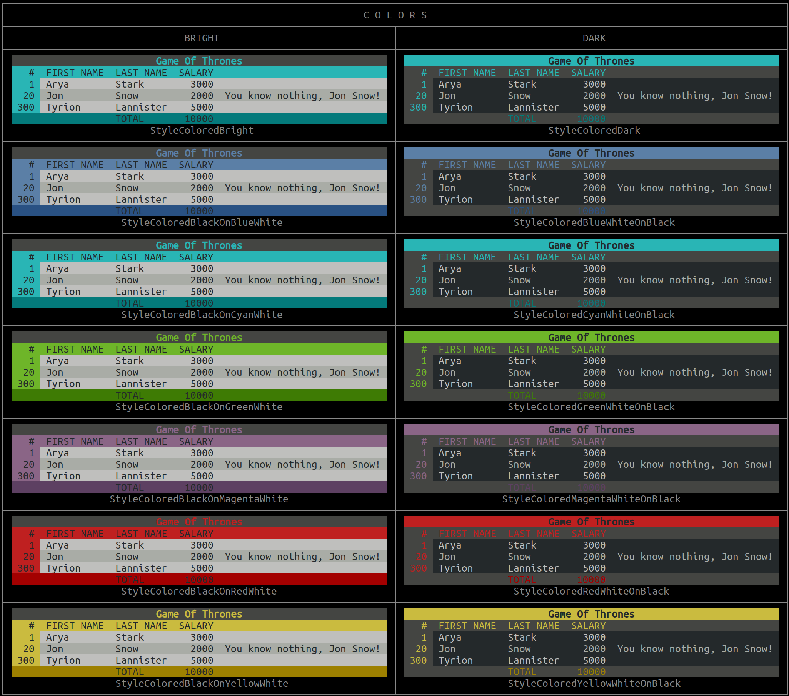

Output of `go run cmd/demo-table/demo.go`:

```
+-----+--------+-----------+------+-----------------------------+
|   1 | Arya   | Stark     | 3000 |                             |
|  20 | Jon    | Snow      | 2000 | You know nothing, Jon Snow! |
| 300 | Tyrion | Lannister | 5000 |                             |
+-----+--------+-----------+------+-----------------------------+
Simple Table with 3 Rows.

+---+-----+--------+-----------+------+-----------------------------+
|   |   A |    B   |     C     |    D |              E              |
+---+-----+--------+-----------+------+-----------------------------+
| 1 |   1 | Arya   | Stark     | 3000 |                             |
| 2 |  20 | Jon    | Snow      | 2000 | You know nothing, Jon Snow! |
| 3 | 300 | Tyrion | Lannister | 5000 |                             |
+---+-----+--------+-----------+------+-----------------------------+
Table with Auto-Indexing.

+---+-----+------------+-----------+--------+-----------------------------+
|   |   # | FIRST NAME | LAST NAME | SALARY |                             |
+---+-----+------------+-----------+--------+-----------------------------+
| 1 |   1 | Arya       | Stark     |   3000 |                             |
| 2 |  20 | Jon        | Snow      |   2000 | You know nothing, Jon Snow! |
| 3 | 300 | Tyrion     | Lannister |   5000 |                             |
+---+-----+------------+-----------+--------+-----------------------------+
Table with Auto-Indexing (columns-only).

+-----+------------+-----------+--------+-----------------------------+
|   # | FIRST NAME | LAST NAME | SALARY |                             |
+-----+------------+-----------+--------+-----------------------------+
|   1 | Arya       | Stark     |   3000 |                             |
|  20 | Jon        | Snow      |   2000 | You know nothing, Jon Snow! |
| 300 | Tyrion     | Lannister |   5000 |                             |
+-----+------------+-----------+--------+-----------------------------+
Table with 3 Rows & and a Header.

+-----+------------+-----------+--------+-----------------------------+
|   # | FIRST NAME | LAST NAME | SALARY |                             |
+-----+------------+-----------+--------+-----------------------------+
|   1 | Arya       | Stark     |   3000 |                             |
|  20 | Jon        | Snow      |   2000 | You know nothing, Jon Snow! |
| 300 | Tyrion     | Lannister |   5000 |                             |
+-----+------------+-----------+--------+-----------------------------+
|     |            | TOTAL     |  10000 |                             |
+-----+------------+-----------+--------+-----------------------------+
Table with 3 Rows, a Header & a Footer.

+-----+------------+-----------+--------+-----------------------------+
|   # | FIRST NAME | LAST NAME | SALARY |                             |
+-----+------------+-----------+--------+-----------------------------+
|   1 |       Arya | Stark     |   3000 |                             |
|  20 |        Jon | Snow      |   2000 | You know nothing, Jon Snow! |
| 300 |     Tyrion | Lannister |   5000 |                             |
|   4 |   Faceless | Man       |      0 | Needs        a        name. |
+-----+------------+-----------+--------+-----------------------------+
|     |            | TOTAL     |  10000 |                             |
+-----+------------+-----------+--------+-----------------------------+
Table with Custom Alignment for 2 columns.

+-----+------------+-----------+--------+-----------------------------+
|   # | FIRST NAME | LAST NAME | SALARY |                             |
+-----+------------+-----------+--------+-----------------------------+
|   1 |       Arya | Stark     |   3000 |                             |
|  20 |        Jon | Snow      |   2000 | You know nothing, Jon Snow! |
| 300 |     Tyrion | Lannister |   5000 |                             |
|   4 |   Faceless | Man       |      0 | Needs        a        name. |
|  13 |     Winter | Valar     |      0 | You                         |
|     |         Is | Morghulis |        | know                        |
|     |     Coming |           |        | nothing,                    |
|     |            |           |        | Jon                         |
|     |            |           |        | Snow!                       |
+-----+------------+-----------+--------+-----------------------------+
|     |            | TOTAL     |  10000 |                             |
+-----+------------+-----------+--------+-----------------------------+
Table with a Multi-line Row.

+-----+------------+-----------+--------+-----------------------------+
|   # | FIRST NAME | LAST NAME | SALARY |                             |
+-----+------------+-----------+--------+-----------------------------+
|   1 |       Arya | Stark     |   3000 |                             |
|  20 |        Jon | Snow      |   2000 | You know nothing, Jon Snow! |
| 300 |     Tyrion | Lannister |   5000 |                             |
|   4 |   Faceless | Man       |      0 | Needs        a        name. |
|  13 |            |           |        | You                         |
|     |     Winter |           |        | know                        |
|     |         Is |           |      0 | nothing,                    |
|     |     Coming | Valar     |        | Jon                         |
|     |            | Morghulis |        | Snow!                       |
+-----+------------+-----------+--------+-----------------------------+
|     |            | TOTAL     |  10000 |                             |
+-----+------------+-----------+--------+-----------------------------+
Table with a Multi-line Row with VAlign.

+-----+------------+-----------+--------+-----------------------------+
|   # | FIRST NAME | LAST NAME | SALARY |                             |
+-----+------------+-----------+--------+-----------------------------+
|   1 |       Arya | Stark     |   3000 |                             |
|  20 |        Jon | Snow      |   2000 | You know nothing, Jon Snow! |
| 300 |     Tyrion | Lannister |   5000 |                             |
|   4 |   Faceless | Man       |      0 |       Needs a    name.      |
|  13 |            |           |        |             You             |
|     |     Winter |           |        |             know            |
|     |         Is |           |      0 |           nothing,          |
|     |     Coming | Valar     |        |             Jon             |
|     |            | Morghulis |        |            Snow!            |
+-----+------------+-----------+--------+-----------------------------+
|     |            | TOTAL     |  10000 |                             |
+-----+------------+-----------+--------+-----------------------------+
Table with a Multi-line Row with VAlign and changed Align.

+-----+------------+-----------+--------+-----------------------------+
|   # | FIRST NAME | LAST NAME | SALARY |                             |
+-----+------------+-----------+--------+-----------------------------+
|   1 |       Arya | Stark     |   3000 |                             |
|  20 |        Jon | Snow      |   2000 | You know nothing, Jon Snow! |
+-----+------------+-----------+--------+-----------------------------+
| 300 |     Tyrion | Lannister |   5000 |                             |
+-----+------------+-----------+--------+-----------------------------+
|     |            | TOTAL     |  10000 |                             |
+-----+------------+-----------+--------+-----------------------------+
Simple Table with 3 Rows and a Separator in-between.

+-----+------------+-----------+--------+-----------------------------+
|   # | FIRST NAME | LAST NAME | SALARY |                             |
+-----+------------+-----------+--------+-----------------------------+
|   1 | Arya       | Stark     |   3000 |                             |
|  20 | Jon        | Snow      |   2000 | You know nothing, Jon Snow! |
| 300 | Tyrion     | Lannister |   5000 |                             |
+-----+------------+-----------+--------+-----------------------------+
|     |            | TOTAL     |  10000 |                             |
+-----+------------+-----------+--------+-----------------------------+
Starting afresh with a Simple Table again.

+-----+------------+-----------+--------+-----------------------------+
|   # | FIRST NAME | LAST NAME | SALARY |                             |
+-----+------------+-----------+--------+-----------------------------+
|   1 | Arya       | Stark     |   3000 |                             |
+-----+------------+-----------+--------+-----------------------------+
|     |            | TOTAL     |  10000 |                             |
+-----+------------+-----------+--------+-----------------------------+
... page break ...
+-----+------------+-----------+--------+-----------------------------+
|   # | FIRST NAME | LAST NAME | SALARY |                             |
+-----+------------+-----------+--------+-----------------------------+
|  20 | Jon        | Snow      |   2000 | You know nothing, Jon Snow! |
+-----+------------+-----------+--------+-----------------------------+
|     |            | TOTAL     |  10000 |                             |
+-----+------------+-----------+--------+-----------------------------+
... page break ...
+-----+------------+-----------+--------+-----------------------------+
|   # | FIRST NAME | LAST NAME | SALARY |                             |
+-----+------------+-----------+--------+-----------------------------+
| 300 | Tyrion     | Lannister |   5000 |                             |
+-----+------------+-----------+--------+-----------------------------+
|     |            | TOTAL     |  10000 |                             |
+-----+------------+-----------+--------+-----------------------------+
Table with a PageSize of 1.

+-----+------------+-----------+--------+------- ~
|   # | FIRST NAME | LAST NAME | SALARY |        ~
+-----+------------+-----------+--------+------- ~
|   1 | Arya       | Stark     |   3000 |        ~
|  20 | Jon        | Snow      |   2000 | You kn ~
| 300 | Tyrion     | Lannister |   5000 |        ~
+-----+------------+-----------+--------+------- ~
|     |            | TOTAL     |  10000 |        ~
+-----+------------+-----------+--------+------- ~
Table with an Allowed Row Length of 50.

╔═════╦════════════╦═══════════╦════════╦═══════ ≈
║   # ║ FIRST NAME ║ LAST NAME ║ SALARY ║        ≈
╠═════╬════════════╬═══════════╬════════╬═══════ ≈
║   1 ║ Arya       ║ Stark     ║   3000 ║        ≈
║  20 ║ Jon        ║ Snow      ║   2000 ║ You kn ≈
║ 300 ║ Tyrion     ║ Lannister ║   5000 ║        ≈
╠═════╬════════════╬═══════════╬════════╬═══════ ≈
║     ║            ║ TOTAL     ║  10000 ║        ≈
╚═════╩════════════╩═══════════╩════════╩═══════ ≈
Table with an Allowed Row Length of 50 in 'StyleDouble'.

╭─────┬────────┬───────────┬────────┬────────────╮
│   # │ FIRST  │ LAST NAME │ SALARY │            │
│     │ NAME   │           │        │            │
├─────┼────────┼───────────┼────────┼────────────┤
│   1 │ Arya   │ Stark     │   3000 │            │
│  20 │ Jon    │ Snow      │   2000 │ You know n │
│     │        │           │        │ othing, Jo │
│     │        │           │        │ n Snow!    │
│ 300 │ Tyrion │ Lannister │   5000 │            │
├─────┼────────┼───────────┼────────┼────────────┤
│     │        │ TOTAL     │  10000 │            │
╰─────┴────────┴───────────┴────────┴────────────╯
Table on a diet.

┌─────┬────────────┬───────────┬────────┬─────────────────────────────┐
│   # │ FIRST NAME │ LAST NAME │ SALARY │                             │
├─────┼────────────┼───────────┼────────┼─────────────────────────────┤
│   1 │ Arya       │ Stark     │   3000 │                             │
│  20 │ Jon        │ Snow      │   2000 │ You know nothing, Jon Snow! │
│ 300 │ Tyrion     │ Lannister │   5000 │                             │
├─────┼────────────┼───────────┼────────┼─────────────────────────────┤
│     │            │ TOTAL     │  10000 │                             │
└─────┴────────────┴───────────┴────────┴─────────────────────────────┘
Table using the style 'StyleLight'.

╔═════╦════════════╦═══════════╦════════╦═════════════════════════════╗
║   # ║ FIRST NAME ║ LAST NAME ║ SALARY ║                             ║
╠═════╬════════════╬═══════════╬════════╬═════════════════════════════╣
║   1 ║ Arya       ║ Stark     ║   3000 ║                             ║
║  20 ║ Jon        ║ Snow      ║   2000 ║ You know nothing, Jon Snow! ║
║ 300 ║ Tyrion     ║ Lannister ║   5000 ║                             ║
╠═════╬════════════╬═══════════╬════════╬═════════════════════════════╣
║     ║            ║ TOTAL     ║  10000 ║                             ║
╚═════╩════════════╩═══════════╩════════╩═════════════════════════════╝
Table using the style 'StyleDouble'.

(-----^------------^-----------^--------^-----------------------------)
[<  #>|<first name>|<last name>|<salary>|<                           >]
{-----+------------+-----------+--------+-----------------------------}
[<  1>|<ARYA      >|<STARK    >|<  3000>|<                           >]
[< 20>|<JON       >|<SNOW     >|<  2000>|<YOU KNOW NOTHING, JON SNOW!>]
[<300>|<TYRION    >|<LANNISTER>|<  5000>|<                           >]
{-----+------------+-----------+--------+-----------------------------}
[<   >|<          >|<total    >|< 10000>|<                           >]
\-----v------------v-----------v--------v-----------------------------/
Table using the style 'funkyStyle'.

┏━━━━━┳━━━━━━━━━━━━┳━━━━━━━━━━━┳━━━━━━━━┳━━━━━━━━━━━━━━━━━━━━━━━━━━━━━┓
┃   # ┃ FIRST NAME ┃ LAST NAME ┃ SALARY ┃                             ┃
┣━━━━━╋━━━━━━━━━━━━╋━━━━━━━━━━━╋━━━━━━━━╋━━━━━━━━━━━━━━━━━━━━━━━━━━━━━┫
┃   1 ┃ Arya       ┃ Stark     ┃   3000 ┃                             ┃
┃  20 ┃ Jon        ┃ Snow      ┃   2000 ┃ You know nothing, Jon Snow! ┃
┃ 300 ┃ Tyrion     ┃ Lannister ┃   5000 ┃                             ┃
┣━━━━━╋━━━━━━━━━━━━╋━━━━━━━━━━━╋━━━━━━━━╋━━━━━━━━━━━━━━━━━━━━━━━━━━━━━┫
┃     ┃            ┃ TOTAL     ┃  10000 ┃                             ┃
┗━━━━━┻━━━━━━━━━━━━┻━━━━━━━━━━━┻━━━━━━━━┻━━━━━━━━━━━━━━━━━━━━━━━━━━━━━┛
Table with Colors.

"┏━━━━━┳━━━━━━━━━━━━┳━━━━━━━━━━━┳━━━━━━━━┳━━━━━━━━━━━━━━━━━━━━━━━━━━━━━┓"
"┃\x1b[47;30m   # \x1b[0m┃\x1b[47;30m FIRST NAME \x1b[0m┃\x1b[47;30m LAST NAME \x1b[0m┃\x1b[47;30m SALARY \x1b[0m┃\x1b[47;30m                             \x1b[0m┃"
"┣━━━━━╋━━━━━━━━━━━━╋━━━━━━━━━━━╋━━━━━━━━╋━━━━━━━━━━━━━━━━━━━━━━━━━━━━━┫"
"┃\x1b[33m   1 \x1b[0m┃\x1b[91m Arya       \x1b[0m┃\x1b[91m Stark     \x1b[0m┃\x1b[32m   3000 \x1b[0m┃\x1b[36m                             \x1b[0m┃"
"┃\x1b[33m  20 \x1b[0m┃\x1b[91m Jon        \x1b[0m┃\x1b[91m Snow      \x1b[0m┃\x1b[32m   2000 \x1b[0m┃\x1b[36m You know nothing, Jon Snow! \x1b[0m┃"
"┃\x1b[33m 300 \x1b[0m┃\x1b[91m Tyrion     \x1b[0m┃\x1b[91m Lannister \x1b[0m┃\x1b[32m   5000 \x1b[0m┃\x1b[36m                             \x1b[0m┃"
"┣━━━━━╋━━━━━━━━━━━━╋━━━━━━━━━━━╋━━━━━━━━╋━━━━━━━━━━━━━━━━━━━━━━━━━━━━━┫"
"┃     ┃            ┃\x1b[47;30m TOTAL     \x1b[0m┃\x1b[47;30m  10000 \x1b[0m┃                             ┃"
"┗━━━━━┻━━━━━━━━━━━━┻━━━━━━━━━━━┻━━━━━━━━┻━━━━━━━━━━━━━━━━━━━━━━━━━━━━━┛"
"Table with Colors in Raw Mode."

   #  FIRST NAME  LAST NAME  SALARY                              
   1  Arya        Stark        3000                              
  20  Jon         Snow         2000  You know nothing, Jon Snow! 
 300  Tyrion      Lannister    5000                              
                  TOTAL       10000                              
Table with style 'StyleColoredBright'.

   # ┃ FIRST NAME ┃ LAST NAME ┃ SALARY ┃                             
━━━━━╋━━━━━━━━━━━━╋━━━━━━━━━━━╋━━━━━━━━╋━━━━━━━━━━━━━━━━━━━━━━━━━━━━━
   1 ┃ Arya       ┃ Stark     ┃   3000 ┃                             
  20 ┃ Jon        ┃ Snow      ┃   2000 ┃ You know nothing, Jon Snow! 
 300 ┃ Tyrion     ┃ Lannister ┃   5000 ┃                             
━━━━━╋━━━━━━━━━━━━╋━━━━━━━━━━━╋━━━━━━━━╋━━━━━━━━━━━━━━━━━━━━━━━━━━━━━
     ┃            ┃ TOTAL     ┃  10000 ┃                             
Table without Borders.

┏━━━━━━━━━━━━━━━━━━━━━━━━━━━━━━━━━━━━━━━━━━━━━━━━━━━━━━━━━━━━━━━━━━━━━┓
┃ Divide!                                                             ┃
┣━━━━━┳━━━━━━━━━━━━┳━━━━━━━━━━━┳━━━━━━━━┳━━━━━━━━━━━━━━━━━━━━━━━━━━━━━┫
┃   # ┃ FIRST NAME ┃ LAST NAME ┃ SALARY ┃                             ┃
┣━━━━━╋━━━━━━━━━━━━╋━━━━━━━━━━━╋━━━━━━━━╋━━━━━━━━━━━━━━━━━━━━━━━━━━━━━┫
┃   1 ┃ Arya       ┃ Stark     ┃   3000 ┃                             ┃
┣━━━━━╋━━━━━━━━━━━━╋━━━━━━━━━━━╋━━━━━━━━╋━━━━━━━━━━━━━━━━━━━━━━━━━━━━━┫
┃  20 ┃ Jon        ┃ Snow      ┃   2000 ┃ You know nothing, Jon Snow! ┃
┣━━━━━╋━━━━━━━━━━━━╋━━━━━━━━━━━╋━━━━━━━━╋━━━━━━━━━━━━━━━━━━━━━━━━━━━━━┫
┃ 300 ┃ Tyrion     ┃ Lannister ┃   5000 ┃                             ┃
┣━━━━━╋━━━━━━━━━━━━╋━━━━━━━━━━━╋━━━━━━━━╋━━━━━━━━━━━━━━━━━━━━━━━━━━━━━┫
┃     ┃            ┃ TOTAL     ┃  10000 ┃                             ┃
┗━━━━━┻━━━━━━━━━━━━┻━━━━━━━━━━━┻━━━━━━━━┻━━━━━━━━━━━━━━━━━━━━━━━━━━━━━┛
Table with Borders Everywhere!

 Unite!                                                          
   #  FIRST NAME  LAST NAME  SALARY                              
   1  Arya        Stark        3000                              
  20  Jon         Snow         2000  You know nothing, Jon Snow! 
 300  Tyrion      Lannister    5000                              
                  TOTAL       10000                              
(c) No one!

[CSV] Unite!
[CSV] #,First Name,Last Name,Salary,
[CSV] 1,Arya,Stark,3000,
[CSV] 20,Jon,Snow,2000,"You know nothing\, Jon Snow!"
[CSV] 300,Tyrion,Lannister,5000,
[CSV] ,,Total,10000,
[CSV] (c) No one!

[HTML] <table class="go-pretty-table">
[HTML]   <caption class="title">Unite!</caption>
[HTML]   <thead>
[HTML]   <tr>
[HTML]     <th align="right">#</th>
[HTML]     <th>First Name</th>
[HTML]     <th>Last Name</th>
[HTML]     <th align="right">Salary</th>
[HTML]     <th>&nbsp;</th>
[HTML]   </tr>
[HTML]   </thead>
[HTML]   <tbody>
[HTML]   <tr>
[HTML]     <td align="right">1</td>
[HTML]     <td>Arya</td>
[HTML]     <td>Stark</td>
[HTML]     <td align="right">3000</td>
[HTML]     <td>&nbsp;</td>
[HTML]   </tr>
[HTML]   <tr>
[HTML]     <td align="right">20</td>
[HTML]     <td>Jon</td>
[HTML]     <td>Snow</td>
[HTML]     <td align="right">2000</td>
[HTML]     <td>You know nothing, Jon Snow!</td>
[HTML]   </tr>
[HTML]   <tr>
[HTML]     <td align="right">300</td>
[HTML]     <td>Tyrion</td>
[HTML]     <td>Lannister</td>
[HTML]     <td align="right">5000</td>
[HTML]     <td>&nbsp;</td>
[HTML]   </tr>
[HTML]   </tbody>
[HTML]   <tfoot>
[HTML]   <tr>
[HTML]     <td align="right">&nbsp;</td>
[HTML]     <td>&nbsp;</td>
[HTML]     <td>Total</td>
[HTML]     <td align="right">10000</td>
[HTML]     <td>&nbsp;</td>
[HTML]   </tr>
[HTML]   </tfoot>
[HTML]   <caption class="caption" style="caption-side: bottom;">(c) No one!</caption>
[HTML] </table>

[Markdown] # Unite!
[Markdown] | # | First Name | Last Name | Salary |  |
[Markdown] | ---:| --- | --- | ---:| --- |
[Markdown] | 1 | Arya | Stark | 3000 |  |
[Markdown] | 20 | Jon | Snow | 2000 | You know nothing, Jon Snow! |
[Markdown] | 300 | Tyrion | Lannister | 5000 |  |
[Markdown] |  |  | Total | 10000 |  |
[Markdown] _(c) No one!_

```


Output of `go run cmd/demo-table/demo.go colors`:


